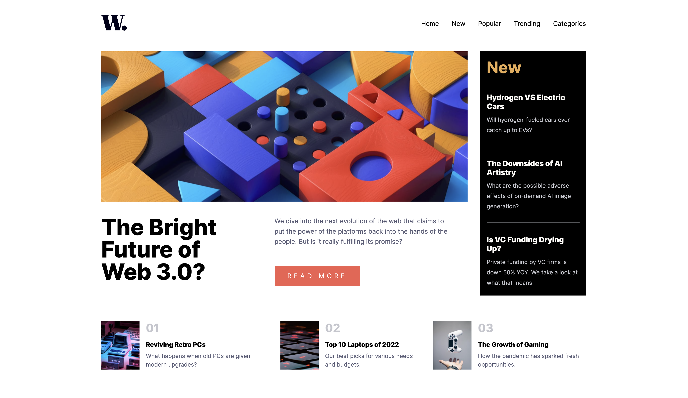

# Frontend Mentor - News homepage solution

This is a solution to the [News homepage challenge on Frontend Mentor](https://www.frontendmentor.io/challenges/news-homepage-H6SWTa1MFl). Frontend Mentor challenges help you improve your coding skills by building realistic projects. 

## Table of contents

- [Overview](#overview)
  - [The challenge](#the-challenge)
  - [Screenshot](#screenshot)
  - [Links](#links)
- [My process](#my-process)
  - [Built with](#built-with)
  - [What I learned](#what-i-learned)
  - [Continued development](#continued-development)
  - [Useful resources](#useful-resources)
- [Author](#author)
- [Acknowledgments](#acknowledgments)

### The challenge

- View the optimal layout for the interface depending on their device's screen size
- See hover and focus states for all interactive elements on the page
- **Bonus**: Toggle the mobile menu (requires some JavaScript)

### Screenshot



### Links

- Solution URL: [https://github.com/Peteonthebeat/News-Home-Page.git]
- Live Site URL: [https://peteonthebeat.github.io/News-Home-Page/]
## My process

### Built with

- Semantic HTML5 markup
- CSS custom properties
- Flexbox
- CSS Grid
- Mobile-first workflow
- JavScript

### What I learned

This is my first time building a hamburger nav, using JS. Also, the 'inset' property in CCS


```html
.proud-of-this-css {
<nav>
  <ul id="primary-navigation" data-visible="false" 
  class="primary-navigation flex">
    <li class="active">
      <a href="#">
        Home
      </a>
    </li>
    <li class="active">
      <a href="#">
       New
      </a>
    </li>
    <li class="active">
      <a href="#">
       Popular
      </a>
    </li>
    <li class="active">
      <a href="#">
        Trending
      </a>
    </li>
    <li class="active">
      <a href="#">
        Categories
      </a>
    </li>
  </ul>
</nav>
}
```

```css
.proud-of-this-css {
  // MEDIA 1 //
@media (max-width: 899px) {
  body {
    .container {
      header {
.sr-only {
  display: none;
}
        .mobile-nav-toggle {
          display: block; 
          position: absolute; 
          background-color: transparent; 
          background-image: url(/assets/images/icon-menu.svg);
          width: 2rem;
          aspect-ratio: 1;
          top: 2rem;
          right: 2em; 
          z-index: 9999;
          background-repeat: no-repeat;
          border: 0;
        }
        .mobile-nav-toggle[aria-expanded="true"] {
          background-image: url(/assets/images/icon-menu-close.svg);
        }
          nav {
            .primary-navigation {
              --gap: 2em; 
              position: fixed;
              inset: 0 0 0 30%; 
              z-index: 1000;
              flex-direction: column;
              padding: 10em 0 60em 2em;
              transform: translateX(100%);
              transition: transform 350ms ease-out;
              // padding: min(50vh, 10rem) 2em;
              font-size: large;
              // HAM BACKGROUND COLOR//
              background: white; 
            }
            .primary-navigation[data-visible="true"] {
              transform: translateX(0%); 
            }
          }
      }
    }
  }
}
}
```

```js
const primaryNav = document.querySelector('.primary-navigation');
const navToggle = document.querySelector('.mobile-nav-toggle'); 

navToggle.addEventListener('click',() => {
const visibility = primaryNav.getAttribute('data-visible')
if (visibility === "false") {
  primaryNav.setAttribute('data-visible', true); 
  navToggle.setAttribute('aria-expanded', true)
} else if (visibility === "true") {
  primaryNav.setAttribute('data-visible', false); 
  navToggle.setAttribute('aria-expanded', false)
}
});
```

### Continued development

I plan to get back to doing the challenges on the Frontend Mentor Website, such as the exercises in the book by @skilldrick, 'Java Script for Kids.' As long as for the former, I plan to focus on more projects similar to this, as they'll allow me to practice building responsive hamburger menus. 
### Useful resources

- [Example resource 2](https://www.youtube.com/watch?v=HbBMp6yUXO0) - This tutorial by Kevin Powell helped immensely.

## Author

- Website - [YouTube.com/@potbtech]
- Frontend Mentor - [@POTB]
 
## Acknowledgments

Kevin Powell's tutorials definitely helped. 
